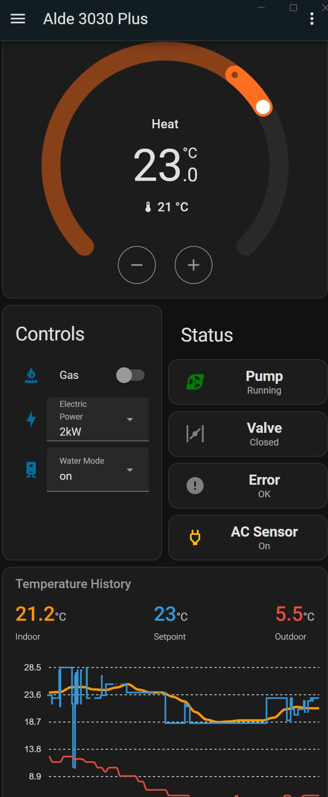

# Alde 3030 Plus - Home Assistant Integration

Control and monitor your Alde Compact 3030 Plus caravan heating system from Home Assistant via MQTT, using a Raspberry Pi Zero 2 connected to the panel's CI-bus.



## Features

- 🌡️ Real-time indoor and outdoor temperature monitoring
- 🎯 Setpoint control from Home Assistant
- 🔥 Gas heating on/off control
- ⚡ Electric power control (Off / 1kW / 2kW / 3kW)
- 💧 Water heating mode control (Off / On / Boost)
- 📊 Circulation pump, gas valve, AC input and error status
- 🔄 Full bidirectional — panel and HA stay in sync
- 💾 Survives reboots of either the Pi or Home Assistant
- 🚀 Sub-second response to commands

---

## Hardware Required

| Component | Notes |
|-----------|-------|
| Raspberry Pi Zero 2 W | Any Pi with hardware UART will work |
| TJA1020 LIN transceiver | LIN/UART transceiver board |
| RJ12 6P6C cable | To connect to the Alde yellow connector |
| Jumper wires | To connect Pi GPIO to TJA1020 |

### Alde Yellow Connector Pinout

The Alde 3030 Plus panel has two RJ12 connectors. We connect to the **yellow** one (the external CI-bus):

```
RJ12 Yellow Connector (looking into socket)
┌─────────────────┐
│ 6  5  4  3  2  1│
└─────────────────┘
        │
        └───── Pin 4: LIN bus signal (10.5V idle) ← connect here
```

> ⚠️ All other pins are unused. Do not connect anything to them.

### Wiring Diagram

The TJA1020 has connections on two sides — the UART side connects to the Pi, and the LIN bus side connects to the Alde panel.

```
Raspberry Pi Zero 2          TJA1020 Board              Alde Connectors
───────────────────          ─────────────              ───────────────
Pin 1  (3.3V)  ────────────► SLP                        
Pin 8  (TXD)   ────────────► RX                         
Pin 10 (RXD)   ◄──────────── TX                         
Pin 9  (GND)   ────────────► GND                        
                             ────── (internal GND link) ──────
                             GND ◄─────────────────────── Red connector GND
                             12V ◄─────────────────────── Red connector 12V
                             LIN ◄─────────────────────── Yellow connector Pin 4

Buck Converter
──────────────
Input 12V  ◄── Red connector 12V
Input GND  ◄── Red connector GND
Output 5V  ──► Pi Zero 2 micro USB (power)
```

**Key points:**
- **SLP pin held high** (3.3V) keeps the TJA1020 active — never pull this low or the transceiver will sleep
- **Common ground** — the two GND pads on the TJA1020 have continuity internally, so Pi GND (pin 9) and Red bus GND share a common reference. This is essential for reliable UART communication
- **Pi is powered** from a 12V→5V buck converter connected to the red bus, via micro USB. No separate power supply needed

---

## Protocol Details

This integration uses the Alde CI-bus, a LIN bus implementation running at **19200 baud, 8N1**.

| Parameter | Value |
|-----------|-------|
| Baud rate | 19200 bps |
| Format | 8N1 |
| Checksum | Enhanced (includes frame ID) |
| Interface | `/dev/ttyAMA0` (Pi hardware UART) |

### Frame Summary

| Frame | Raw ID | Wire ID (with parity) | Direction | Purpose |
|-------|--------|-----------------------|-----------|---------|
| Diagnostic | 0x3C | 0x3C | Pi → Panel | Registration handshake |
| Control | 0x1A | 0x1A | Pi → Panel | Send setpoint and settings |
| Info | 0x1B | 0x5B | Pi → Panel (header) / Panel → Pi (data) | Read panel status |

> ℹ️ LIN frame IDs include two parity bits (bits 6-7). The raw ID is the base identifier. The wire ID is what is actually transmitted. For 0x1A the parity bits happen to be zero so raw and wire are the same. For 0x1B the parity bits give 0x5B on the wire.

For full protocol documentation see [PROTOCOL.md](PROTOCOL.md).

---

## Raspberry Pi Setup

### 1. Operating System

Install Raspberry Pi OS Lite (64-bit) using Raspberry Pi Imager. Enable SSH and set your hostname/credentials in the imager before writing.

### 2. Enable Hardware UART

The Pi Zero 2 has Bluetooth on the main UART by default. We need to free it up:

```bash
sudo nano /boot/firmware/config.txt
```

Add at the bottom:
```ini
# Disable Bluetooth to free up hardware UART
dtoverlay=disable-bt

# Optional: reduce clock speed to save power
# UART timing is unaffected by CPU clock changes
arm_freq=600
over_voltage=-4
hdmi_blanking=2
```

Disable the Bluetooth service:
```bash
sudo systemctl disable hciuart
sudo reboot
```

### 3. Disable Serial Console

The serial port is used as a console by default — we need to disable that:

```bash
sudo raspi-config
```

Go to **Interface Options → Serial Port**:
- "Would you like a login shell to be accessible over the serial port?" → **No**
- "Would you like the serial port hardware to be enabled?" → **Yes**

Reboot after making changes.

### 4. Install Dependencies

```bash
pip install paho-mqtt --break-system-packages
```

### 5. Clone This Repository

```bash
cd /home/alde
git clone https://github.com/YOUR_USERNAME/alde-3030-ha.git .
```

---

## Home Assistant Setup

### Prerequisites

- Home Assistant with MQTT integration configured
- Mosquitto MQTT broker (the HA add-on works perfectly)

### MQTT Configuration

Edit `alde_mqtt.py` and update the MQTT settings at the top of the file:

```python
MQTT_HOST = 'homeassistant.local'  # or your HA IP address
MQTT_PORT = 1883
MQTT_USER = 'your_mqtt_username'
MQTT_PASS = 'your_mqtt_password'
```

### Test the Connection

Before setting up the service, test it runs correctly:

```bash
python3 alde_mqtt.py
```

You should see output like:
```
Alde 3030 Plus - MQTT Bridge v17
==================================================
Waiting for MQTT connection...
[MQTT] Connected to homeassistant.local
[MQTT] All discovery configs published
Reading initial panel state...
  zone1=21.0°C  sp=20.0°C  gas=1  elec=2kW  water=on  pump=1  outdoor=8.0°C
Running... Press Ctrl+C to stop
```

The Alde device should appear automatically in Home Assistant under **Settings → Devices & Services → MQTT**.

---

## Running as a Service

To make `alde_mqtt.py` start automatically every time the Pi boots, and restart automatically if it ever crashes, we set it up as a systemd service.

Create the service file:

```bash
sudo nano /etc/systemd/system/alde.service
```

Paste the following:

```ini
[Unit]
Description=Alde 3030 Plus MQTT Bridge
After=network.target
Wants=network-online.target
StartLimitIntervalSec=0

[Service]
Type=simple
User=alde
WorkingDirectory=/home/alde
ExecStart=/usr/bin/python3 /home/alde/alde_mqtt.py
Restart=always
RestartSec=10
StandardOutput=journal
StandardError=journal

[Install]
WantedBy=multi-user.target
```

Then enable and start it:

```bash
sudo systemctl daemon-reload
sudo systemctl enable alde.service
sudo systemctl start alde.service
sudo systemctl status alde.service
```

- `systemctl enable` — registers the service to start automatically on every boot
- `systemctl start` — starts it immediately without needing a reboot
- `Restart=always` — if the script stops for any reason it will automatically restart
- `RestartSec=10` — waits 10 seconds before restarting to avoid rapid restart loops
- `StartLimitIntervalSec=0` — keeps retrying indefinitely, useful if the network or MQTT broker isn't available immediately at boot

### Useful Commands

```bash
# Check service is running
sudo systemctl status alde.service

# View live logs
sudo journalctl -u alde.service -f

# Restart the service manually
sudo systemctl restart alde.service

# Stop the service
sudo systemctl stop alde.service
```

---

## Home Assistant Dashboard

A ready-made dashboard is included in `alde_dashboard.yaml`. To install it:

### Prerequisites

The dashboard requires two HACS custom cards:

- **[ApexCharts Card](https://github.com/RomRider/apexcharts-card)** — for the temperature history graph
- **[Button Card](https://github.com/custom-cards/button-card)** — for the colour-coded status indicators

Install both via HACS before adding the dashboard.

### Installation

1. In Home Assistant go to **Settings → Dashboards**
2. Click **Add Dashboard** and give it a name (e.g. "Alde Heating")
3. Open the dashboard and click the three dots → **Edit Dashboard**
4. Click the three dots again → **Raw Configuration Editor**
5. Replace all content with the contents of `alde_dashboard.yaml`

The dashboard includes:
- Current indoor, setpoint and outdoor temperatures
- 24-hour temperature history graph
- Thermostat control dial
- Gas, electric power and water mode controls
- Status indicators for pump, valve, AC input and error

---

## Entities Created

| Entity ID | Type | Description |
|-----------|------|-------------|
| `climate.alde_3030` | Climate | Temperature dial and setpoint |
| `switch.alde_gas` | Switch | Gas heating on/off |
| `select.alde_electric` | Select | Electric power: Off/1kW/2kW/3kW |
| `select.alde_water` | Select | Water mode: off/on/boost |
| `sensor.alde_outdoor` | Sensor | Outdoor temperature (°C) |
| `binary_sensor.alde_pump` | Binary sensor | Circulation pump running |
| `binary_sensor.alde_valve` | Binary sensor | Gas valve open |
| `binary_sensor.alde_ac` | Binary sensor | AC mains input present |
| `binary_sensor.alde_error` | Binary sensor | Error flag |

---

## Tested On

- Alde Compact 3030 Plus (single zone)
- Raspberry Pi Zero 2 W
- Home Assistant OS 2026.3.2
- Mosquitto MQTT broker (HA add-on)

## Compatibility

This integration connects to the **yellow CI-bus** connector on the Alde 3030 Plus panel. It may also work with other Alde models that use the same CI-bus protocol — contributions and test reports welcome.

> ℹ️ The Alde Smart Control accessory (Alde's own GSM module) only supports 3010 and 3020 panels. This integration was reverse engineered specifically for the 3030 Plus.

---

## Notes

- **Remote Control setting**: You do not need to enable "Remote Control" in the panel's System Configuration. Commands work either way. If it is enabled, the panel will show a "Remote control missing" error — this is cosmetic and does not affect functionality.
- **Auto water mode**: The panel's "Auto" water heating mode is panel-side intelligence and is not visible on the CI-bus. Only Off/On/Boost are controllable.
- **Outdoor temperature resolution**: The Alde outdoor sensor has ~1°C physical resolution despite the protocol supporting 0.5°C steps. Steps of 1.0–1.5°C are normal.
- **Zone 2**: The protocol supports two zones. Zone 2 reports as unused on single-zone systems.

---

## Contributing

Contributions are very welcome! Particularly:

- Testing on other Alde models (3020, 3030 non-plus etc)
- Testing with two-zone systems
- Home Assistant automation examples
- ESPHome port
- Docker container

Please open an issue or pull request on GitHub.

---

## Acknowledgements

- [WomoLIN project](https://wiki.womonet.io/protocols/lin/alde/) — CI-bus protocol documentation
- [inetbox.py](https://github.com/danielfett/inetbox.py) — LIN bus implementation reference (Truma)
- [WomoLIN Telegram group](https://t.me/womo_LIN) — community support

---

## Licence

MIT Licence — see [LICENSE](LICENSE) for details.
